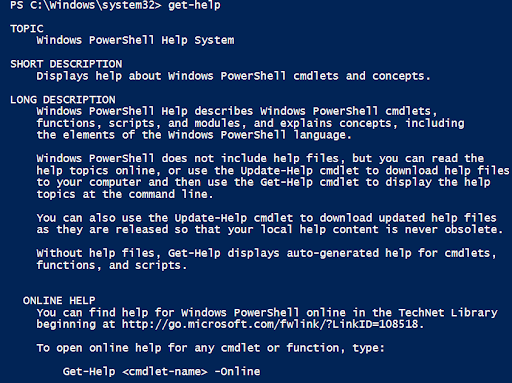
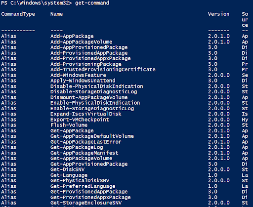
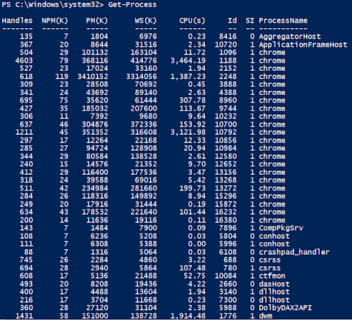

# GitHub-Powershell-Mini-Project

 I will discuss PowerShell commands and their uses in this mini-project. Powershell is a Microsoft tool that allows you to automate tasks on your computer through commands. Powershell is a stronger version of the command prompt as you have more control over your commands, such as managing files, setting up networks, and controlling settings. Starting Powershell can be a bit confusing at first, but with practice and these useful commands, you will learn quickly.

<h2>Get-Help</h2>

Get-Help is a useful command to help understand what a specific cmdlet does and explain concepts.

<h2>Get-Command</h2>

Get-command displays all cmdlets or helps locate a specific cmdlet through filters.

<h2>Get-Process</h2>

Get-Process displays all the active processes running on the computer 

<h2>Get-Service</h2>

Get-Service displays all the system services running or stopped.

