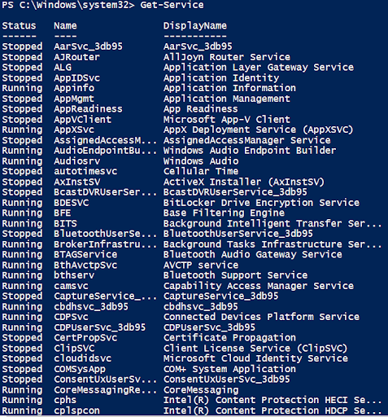
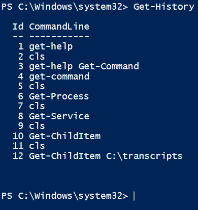

# GitHub-Powershell-Mini-Project

 I will discuss PowerShell commands and their uses in this mini-project. Powershell is a Microsoft tool that allows you to automate tasks on your computer through commands. Powershell is a stronger version of the command prompt as you have more control over your commands, such as managing files, setting up networks, and controlling settings. Starting Powershell can be a bit confusing at first, but with practice and these useful commands, you will learn quickly.

<h2>Get-Help</h2>

Get-Help is a useful command to help understand what a specific cmdlet does and explain concepts.

<h2>Get-Command</h2>

Get-command displays all cmdlets or helps locate a specific cmdlet through filters. It helps beginners explore and discover PowerShell commands easily.

<h2>Get-Process</h2>

Get-Process displays all the active processes running on the computer. It allows beginners to view and understand running processes on their system.  

<h2>Get-Service</h2>

Get-Service displays all the system services running or stopped. It provides an easy way for beginners to view and manage services on their system. 

<h2>Get-History</h2>

Get-History lists all the previously run commands in the current session. It is helpful to review and reuse previous commands.

<h2>Clear-Host</h2>

Clear-Host is a command that clears the console display, removing previous outputs. It is useful to beginners to quickly clear their console screen, to help them focus on new outputs and keep their workspace organized.

<h3>Conclusion</h3>

In Conclusion, these PowerShell commands equip beginners with tools for automating tasks and managing their systems efficiently. Commands like Get-Help and Get-Command enable newcomers to navigate their environment with confidence and lay a solid foundation for further learning and productivity.

